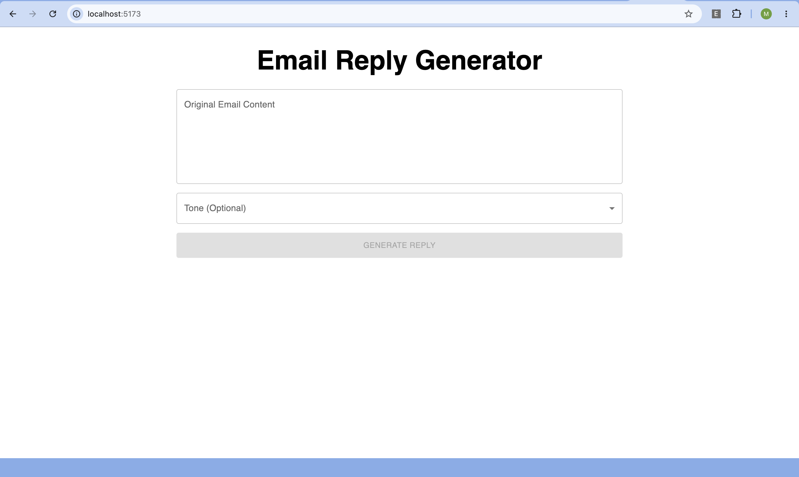
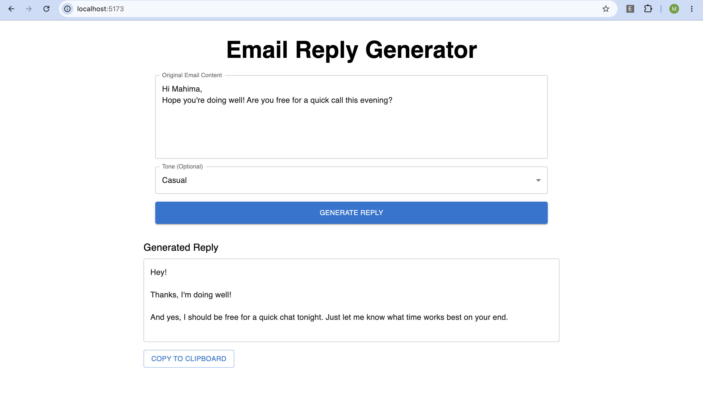
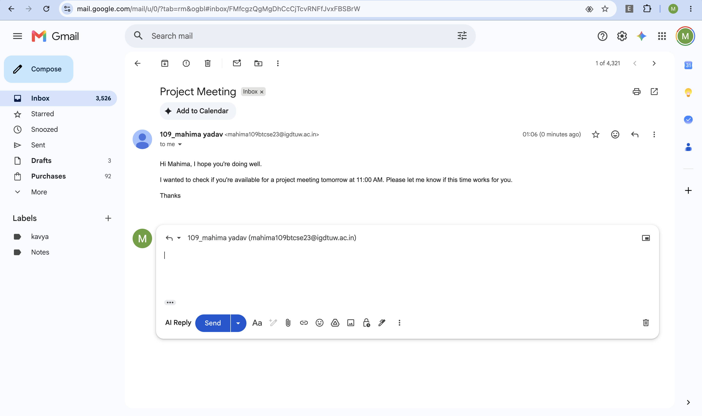
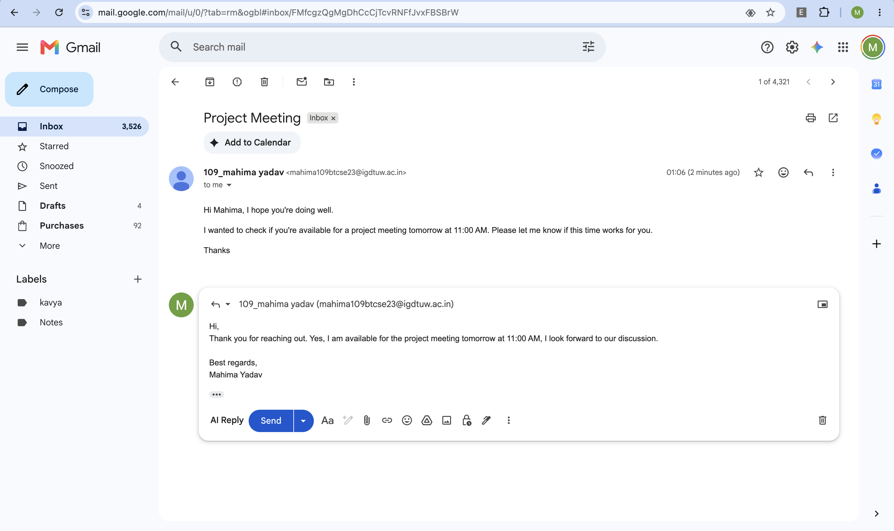

# AI Email Reply Generator

An AI-powered email reply assistant built using **Spring Boot**, **React**, and the **Google Gemini API**.

This project includes a Chrome Extension that adds an **AI Reply** button directly inside Gmail. When clicked, it sends the email content to a Spring Boot backend, generates a context-aware reply using Google's Gemini API, and automatically inserts the response into the Gmail compose box.

A React frontend is also included to independently test and generate AI-powered email replies.

---

## Features

* Generate AI-powered email replies
* Chrome Extension integrated with Gmail
* Multiple reply tones (Professional, Casual, Friendly, etc.)
* React frontend for testing replies
* Spring Boot REST API backend
* Google Gemini API integration
* Secure API key management using environment variables

---

## Tech Stack

### Backend

* Java
* Spring Boot
* Maven
* Spring Web
* WebClient

### Frontend

* React
* Vite
* Material UI
* Axios

### Chrome Extension

* JavaScript
* Chrome Extension Manifest V3
* MutationObserver
* DOM Manipulation

### AI

* Google Gemini API

---

## Project Structure

```text
AI-Email-Reply-Generator
│
├── email-writer-sb
├── email-writer-react
├── email-writer-ext
└── screenshots
```

---

## Screenshots

### React Frontend



---

### Generated Reply



---

### Gmail Extension



---

### AI Reply in Gmail



---

## How It Works

1. Open Gmail and click **Reply**.
2. The Chrome Extension injects an **AI Reply** button.
3. The email content is sent to the Spring Boot backend.
4. The backend sends the request to the Gemini API.
5. Gemini generates a contextual email reply.
6. The generated response is automatically inserted into the Gmail compose window.

---

## Running the Project

### Backend

```bash
cd email-writer-sb
./mvnw spring-boot:run
```

Backend runs on:

```text
http://localhost:8085
```

### Frontend

```bash
cd email-writer-react
npm install
npm run dev
```

Frontend runs on:

```text
http://localhost:5173
```

### Chrome Extension

1. Open `chrome://extensions`
2. Enable **Developer Mode**
3. Click **Load unpacked**
4. Select the `email-writer-ext` folder

---

## Environment Variables

Create the following environment variable before running the backend:

```text
GEMINI_KEY=YOUR_API_KEY
```

The API key is intentionally not included in this repository.

---

## Future Improvements

* Email summarization
* Custom reply templates
* Reply history
* Authentication
* Cloud deployment
* Support for multiple email providers
